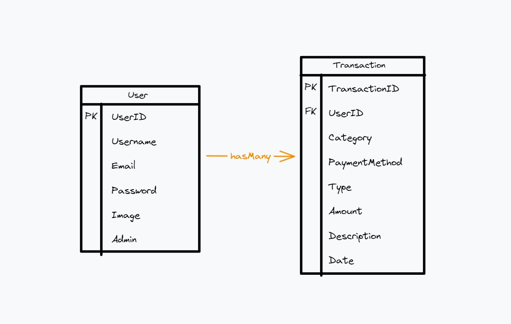

# Trabalho de Desenvolvimento WEB

Trabalho final da disciplina de Desenvolvimento de Aplicações WEB do curso de Análise e Desenvolvimento de Sistemas da Universidade de Fortaleza (Unifor). O Trabalho consiste em desenvolver uma aplicação com tema livre, mas haja controle de acessos (user e admin), uma landing page e um sistema de login.

## Tecnologias usadas

- Angular e PrimeNG para o frontend
- Java e Spring para o backend
- MongoDB para o banco de dados

## Modelagem de dados



## Endpoints

### `POST` /auth

Endpoint utilizado para autenticar um usuário e obter informações de um usuário específico.

**Corpo da Requisição:**

```json
{
  "email": "seuemail@mail.com",
  "password": "12345678"
}
```

**Resposta da Requisição:**

```json
{
  "_id": "some-hash",
  "userName": "fulano de tal",
  "email": "seu.email@mail.com",
  "image": "some-url",
  "admin": true
}
```

### `POST` /users

Endpoint utilizado para criar um novo usuário e obter suas informações.

**Corpo da Requisição:**

```json
{
  "userName": "Fulano",
  "email": "seuemail@mail.com",
  "password": "12345678"
}
```

**Resposta da Requisição:**

```json
{
  "_id": "some-hash",
  "userName": "fulano de tal",
  "email": "seu.email@mail.com",
  "image": "",
  "admin": false
}
```

### `GET` /users 

Endpoint utilizado para obter informações de todos os usuários. 

`somente para usuários administradores`

**Resposta da Requisição:**

```json
[
  {
    "_id": "some-hash-1",
    "userName": "fulano de tal",
    "email": "seu.email@mail.com",
    "image": "some-url-1",
    "admin": true
  },
  {
    "_id": "some-hash-2",
    "userName": "Beltrano",
    "email": "outro.email@mail.com",
    "image": "some-url-2",
    "admin": false
  }
]
```

### `GET` /transacoes/:user-id

Endpoint utilizado para obter todas as transações de um determinado usuário.

**Resposta da Requisição:**

```json
[
  {
    "_id": "some-hash-1",
    "type": "receita",
    "amount": 79.9,
    "transactionWith": "some-store",
    "description": "some-description",
    "date": "2024-05-20",
    "category": "alimentação",
    "paymentMethod": "cartao de crédito"
  },
  {
    "_id": "some-hash-2",
    "type": "despesa",
    "amount": 59.9,
    "transactionWith": "some-store",
    "description": "some-description",
    "date": "2024-05-20",
    "category": "salario",
    "paymentMethod": "pix"
  }
]
```

### `POST` /transacoes

Endpoint utilizado para criar uma nova transação.

**Corpo da Requisição:**

```json
{
  "type": "despesa",
  "amount": 59.9,
  "transactionWith": "some-store",
  "description": "some-description",
  "date": "2024-05-20",
  "category": "salario",
  "paymentMethod": "pix"
}
```

**Resposta da Requisição:**

```json
{
  "success": true
}
```

### `PUT` /transacoes/:id

Endpoint utilizado para atualizar uma transação existente.

**Corpo da Requisição:**

```json
{
  "type": "despesa",
  "amount": 59.9,
  "transactionWith": "some-store",
  "description": "some-description",
  "date": "2024-05-20",
  "category": "salario",
  "paymentMethod": "pix"
}
```

**Resposta da Requisição:**

```json
{
  "success": true
}
```

### `DELETE` /transacoes

Endpoint utilizado para excluir uma transação existente.

**Resposta da Requisição:**

```json
{
  "success": true
}
```

## Licença

Este projeto está licenciado sob a Licença MIT.
